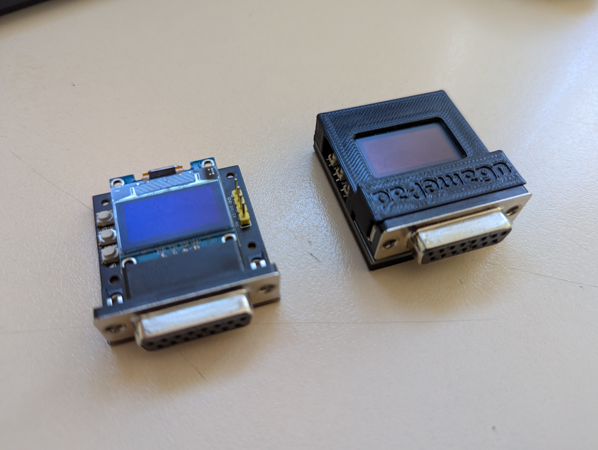
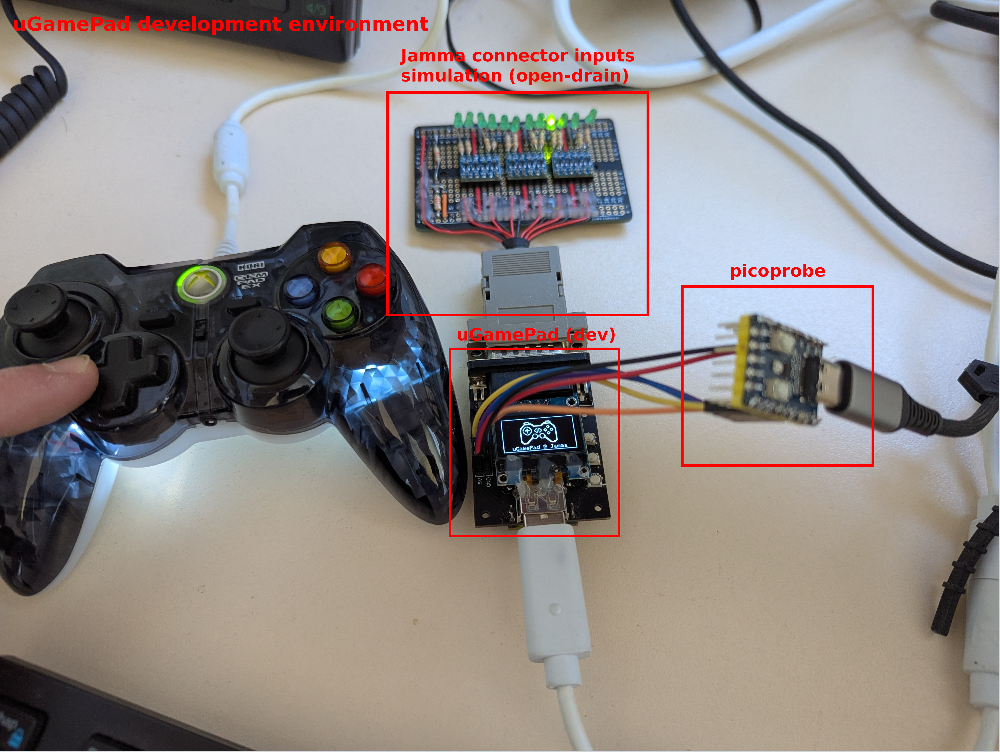
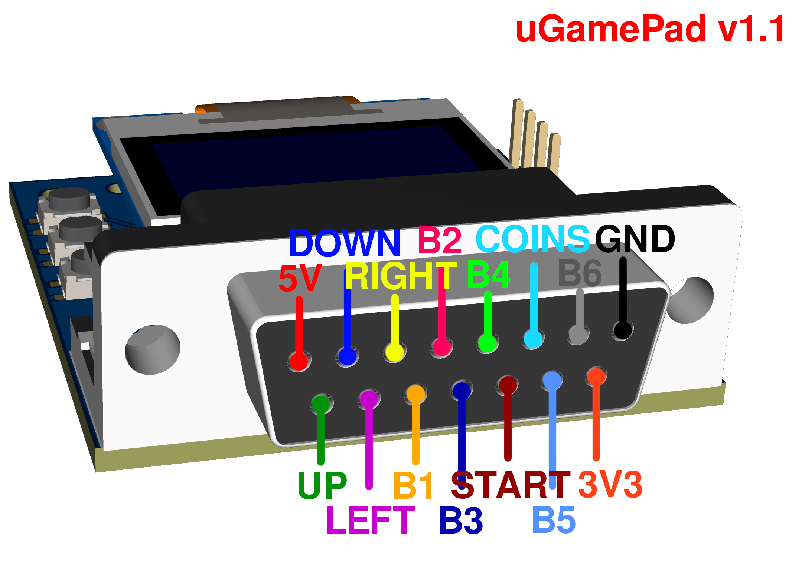

# uGamePad


## Info

uGamePad is an usb gamepad to db15 adapter for jamma arcade superguns, using a pi pico (rp2040)

## Usage
Connect device via USB to computer pressing button:
 - **UP**: device start in bootloader mode for updating/flashing.
 - **DOWN**: device start in usb storage mode, access uGamePad configuration and devices files (1MB flash fs).

## Currently supported gamepads

SNK Neo-Geo Mini, Xbox, (Xbox One not tested), DualShock 4, (DualShock 5 not tested), cheap SNES USB Gamepad...
See [devices.cpp](src/devices.cpp)

## Adding support for new gamepad
`lsusb`
```
Bus 001 Device 010: ID 0079:0011 DragonRise Inc. Gamepad
sudo usbhid-dump -s 001:010 -f -e stream
```

Add a device descriptor to uGamePad flash fs (via USB) in the "devices" folder (replace vid/pid):

`flashfs:/devices/vid-pid.json`

<details>
<summary>Hori GEM Xbox controller</summary>

```
{
  "vid": "24c6",
  "pid": "550d",
  "name": "Hori GEM Xbox controller",
  "input_descriptor": {
    "report_size": 16,
    "is_xbox": true,
    "joystick": {
      "button_count": 12,
      "dead_zone": 8000,
      "axis": [
        {
          "offset": 48,
          "size": 16,
          "logical": [
            -32768,
            32767
          ]
        },
        {
          "offset": 64,
          "size": 16,
          "logical": [
            -32768,
            32767
          ]
        },
        {
          "offset": 80,
          "size": 16,
          "logical": [
            -32768,
            32767
          ]
        },
        {
          "offset": 96,
          "size": 16,
          "logical": [
            -32768,
            32767
          ]
        }
      ],
      "buttons": [
        {
          "byte_offset": 3,
          "bitmask": 16
        },
        {
          "byte_offset": 3,
          "bitmask": 32
        },
        {
          "byte_offset": 3,
          "bitmask": 64
        },
        {
          "byte_offset": 3,
          "bitmask": 128
        },
        {
          "byte_offset": 3,
          "bitmask": 1
        },
        {
          "byte_offset": 3,
          "bitmask": 2
        },
        {
          "byte_offset": 2,
          "bitmask": 16
        },
        {
          "byte_offset": 2,
          "bitmask": 32
        },
        {
          "byte_offset": 2,
          "bitmask": 4
        },
        {
          "byte_offset": 2,
          "bitmask": 8
        },
        {
          "byte_offset": 2,
          "bitmask": 1
        },
        {
          "byte_offset": 2,
          "bitmask": 2
        }
      ],
      "hat": {
        "offset": 0,
        "size": 0,
        "logical": [
          0,
          0
        ],
        "physical": [
          0,
          0
        ]
      },
      "init": {
        "size": 3,
        "bytes": [
          1,
          3,
          2
        ]
      }
    }
  }
}
```
</details>

<details>
<summary>DualShock 4 (054c:05c4)</summary>

```
{
  "vid": "054c",
  "pid": "05c4",
  "name": "DualShock 4",
  "input_descriptor": {
    "report_size": 63,
    "is_xbox": false,
    "joystick": {
      "button_count": 8,
      "dead_zone": 8000,
      "axis": [
        {
          "offset": 8,
          "size": 8,
          "logical": [
            0,
            255
          ]
        },
        {
          "offset": 16,
          "size": 8,
          "logical": [
            0,
            255
          ]
        },
        {
          "offset": 24,
          "size": 8,
          "logical": [
            0,
            255
          ]
        },
        {
          "offset": 32,
          "size": 8,
          "logical": [
            0,
            255
          ]
        }
      ],
      "buttons": [
        {
          "byte_offset": 5,
          "bitmask": 32
        },
        {
          "byte_offset": 5,
          "bitmask": 64
        },
        {
          "byte_offset": 5,
          "bitmask": 16
        },
        {
          "byte_offset": 5,
          "bitmask": 128
        },
        {
          "byte_offset": 6,
          "bitmask": 1
        },
        {
          "byte_offset": 6,
          "bitmask": 2
        },
        {
          "byte_offset": 6,
          "bitmask": 32
        },
        {
          "byte_offset": 6,
          "bitmask": 16
        }
      ],
      "hat": {
        "offset": 40,
        "size": 4,
        "logical": [
          0,
          7
        ],
        "physical": [
          0,
          315
        ]
      },
      "init": {
        "size": 0
      }
    }
  }
}
```

</details>

<details>
<summary>SNK Neo-Geo Mini (0e6f:1112)</summary>

```
{
  "vid": "0e6f",
  "pid": "1112",
  "name": "SNK Neo-Geo Mini",
  "input_descriptor": {
    "report_size": 27,
    "is_xbox": false,
    "joystick": {
      "button_count": 8,
      "axis": [
        {
          "offset": 0,
          "size": 0,
          "logical": [
            0,
            0
          ]
        },
        {
          "offset": 0,
          "size": 0,
          "logical": [
            0,
            0
          ]
        },
        {
          "offset": 0,
          "size": 0,
          "logical": [
            0,
            0
          ]
        },
        {
          "offset": 0,
          "size": 0,
          "logical": [
            0,
            0
          ]
        }
      ],
      "buttons": [
        {
          "byte_offset": 0,
          "bitmask": 2
        },
        {
          "byte_offset": 0,
          "bitmask": 1
        },
        {
          "byte_offset": 0,
          "bitmask": 4
        },
        {
          "byte_offset": 0,
          "bitmask": 8
        },
        {
          "byte_offset": 255,
          "bitmask": 255
        },
        {
          "byte_offset": 255,
          "bitmask": 255
        },
        {
          "byte_offset": 1,
          "bitmask": 2
        },
        {
          "byte_offset": 1,
          "bitmask": 1
        }
      ],
      "hat": {
        "offset": 16,
        "size": 4,
        "logical": [
          0,
          7
        ],
        "physical": [
          0,
          315
        ]
      },
      "init": {
        "size": 0
      }
    }
  }
}
```
</details>

## Testing/debug in linux with an xbox 360 controller

A lot of work have been made to support linux for easier debugging (including rendering, flashfs, hid raw access, etc...). This allows, for example, adding support for new gamedads or add new functionality without actually using/having the device.

`lsusb`
```
Bus 003 Device 004: ID 24c6:550d ThrustMaster, Inc. Hori Gem Controller for Xbox 360
```
`sudo nano /etc/udev/rules.d/72-ugamepad.rules`
```
# Add hid raw access for this specific controllers
# ThrustMaster, Inc. Hori Gem Controller for Xbox 360

KERNEL=="hidraw*", ATTRS{idVendor}=="24c6", ATTRS{idProduct}=="550d", MODE="0660", TAG+="uaccess"
SUBSYSTEM=="usb", ATTRS{idVendor}=="24c6", ATTRS{idProduct}=="550d", MODE="0666"
```

## Pics





## uGamePad DB15 pinout (v1.1)



## TODO

- Allow entering menu when no gamepad connected...
- Add "info" submenu (app version, etc...)

# OLD NOTES - TODO: CLEANUP

## Nintendo Nes

Resources :
* 1 - [nesdev](https://www.nesdev.org/wiki/Controller_port_pinout)
* 2 - [tresi](https://tresi.github.io/nes/)

Controller pinout :


[Nintendo Nes wire colors (aliexpress)](https://fr.aliexpress.com/item/33011370991.html?spm=a2g0o.order_list.order_list_main.6.6bf65e5bZjQmvi&gatewayAdapt=glo2fra) :
```
1   gnd     white
2   clock   green
3   latch   yellow
4   data    black
7   5v      red

```

[Nintendo Snes wire colors (aliexpress)](https://fr.aliexpress.com/item/33011370991.html?spm=a2g0o.order_list.order_list_main.6.6bf65e5bZjQmvi&gatewayAdapt=glo2fra) :
```
1   gnd     black 
2   clock   yellow
3   latch   white
4   data    red
7   5v      green

```

## Sega Genesis

Resources : 
* 1 - [plutiedev](https://plutiedev.com/io-pinout#md-port)
* 2 - [jonthysell](https://github.com/jonthysell/SegaController/wiki/How-To-Read-Sega-Controllers)
* 3 - [raspberryfield](https://www.raspberryfield.life/2019/02/15/sega-mega-drive-genesis-3-button-abc-controller/)
* 4 - [pinoutguide](https://pinoutguide.com/Game/genesiscontroller_pinout.shtml)

Controller pinout :


[Sega Genesis wire colors (aliexpress)](https://fr.aliexpress.com/item/1005002864827866.html?spm=a2g0o.order_detail.order_detail_item.13.22277d56hgr2Fe&gatewayAdapt=glo2fra) :
```
1   data0   red
2   data1   black
3   data2   grey
4   data3   orange
5   5v      brown
6   tl      green
7   th      white
8   gnd     blue
9   tr      yellow
```

I use [JetBrains CLion](https://www.jetbrains.com/clion/) IDE for all my open sources projects, thanks to the support !
